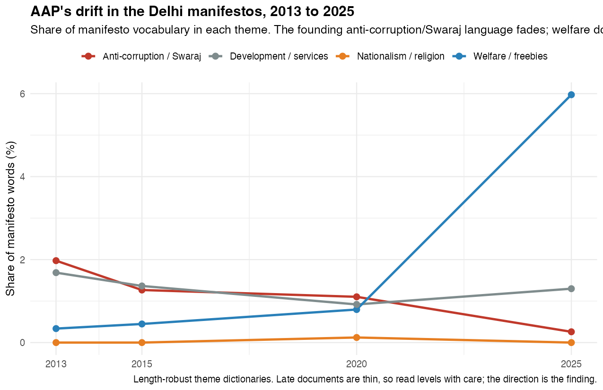
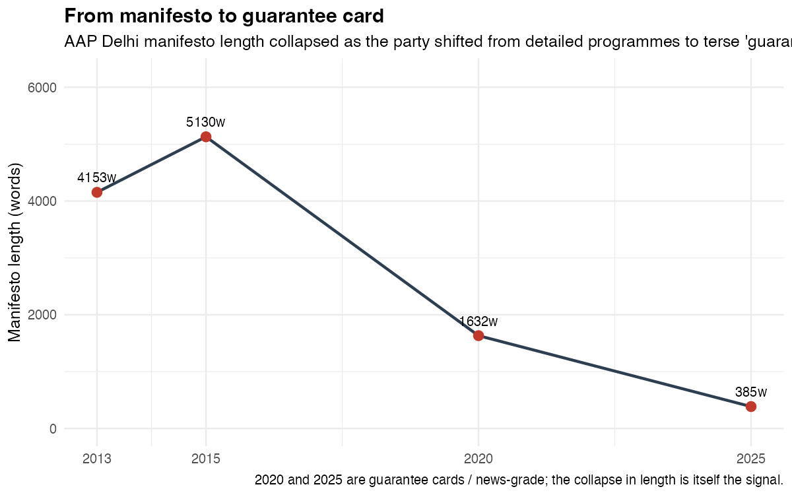
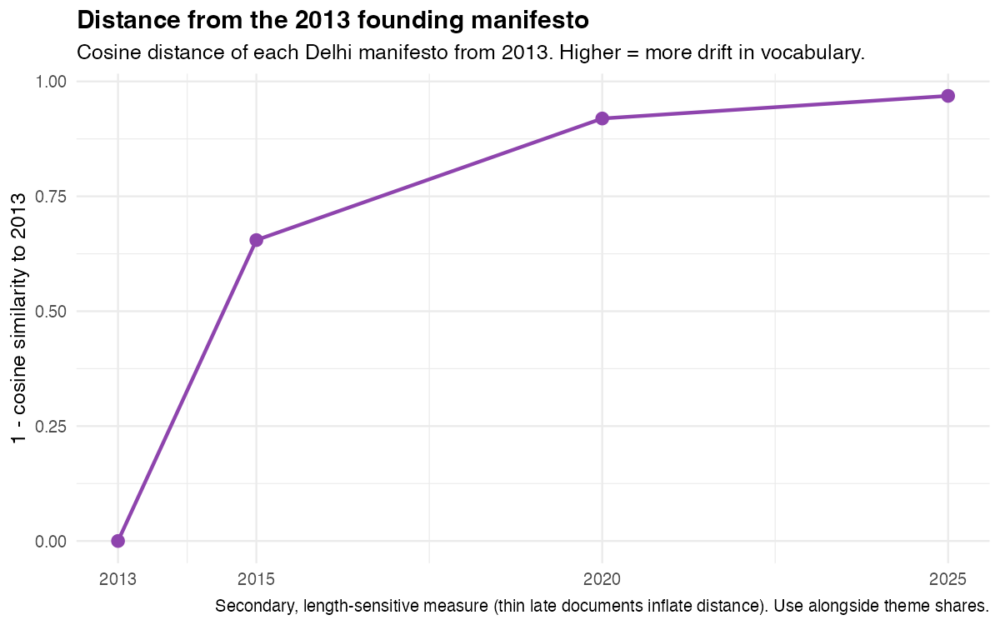
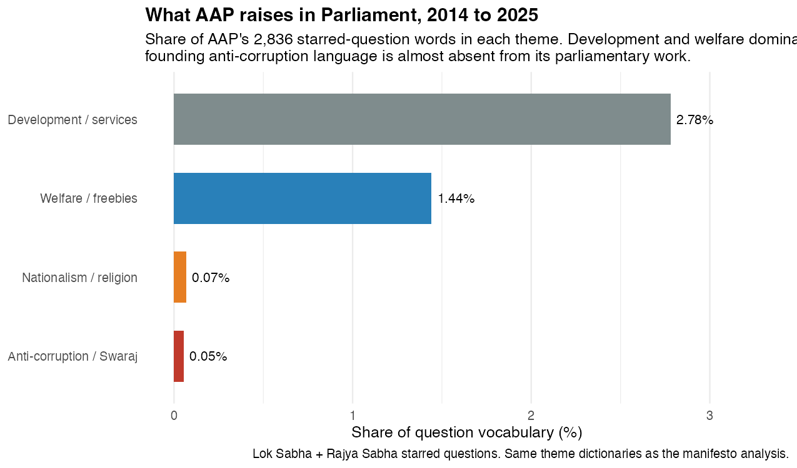

In November 2013, the Aam Aadmi Party published a manifesto for Delhi that promised to pass a Jan Lokpal bill within fifteen days of taking office. The word "corruption" and its cousins made up almost two percent of everything the document said. The party had grown straight out of a street movement against graft, and it talked like it. Power would be handed down to neighbourhood assemblies. Citizens would audit their own government. The broom on the party symbol was not subtle.

Twelve years later the party released its Delhi manifesto for 2025. It was a list of fifteen guarantees, mostly cash and free services, that fit on a card. Corruption was barely mentioned. Free bus rides, a monthly allowance for women, money for priests and granthis. The anti-corruption party had stopped talking about anti-corruption.

This is not an impression. I read every AAP manifesto I could find from 2013 to 2025, alongside 2,836 starred questions its MPs asked in Parliament, and measured what the party chose to talk about. The drift is not subtle either.

## The founding idea, in numbers

To track what a party cares about, count the words it spends. I built four small dictionaries, one for the anti-corruption and Swaraj language the party was founded on, one for welfare and freebies, one for development and services, and one for nationalist and religious appeals. Then I measured each manifesto by the share of its words that fell into each bucket. The method is crude on purpose. It survives the fact that the later documents are short, and it answers a simple question: of all the things AAP could talk about, which did it actually choose?

In 2013, the founding language won. Anti-corruption and Swaraj took up 1.97 percent of the Delhi manifesto, more than welfare and development combined. By 2015 it was 1.27 percent. By 2020, 1.10. By 2025 it had fallen to 0.26 percent, a collapse of almost ninety percent from where the party started. Over the same years welfare went the other way, from a third of a percent in 2013 to nearly six percent in 2025. The two lines cross.

{width=100%}

That crossover is the whole story in one picture. The party that came to power promising to make government honest left office promising to make it generous. Neither is disqualifying on its own. Plenty of good governments run on welfare. But it is a different party from the one that was sold to voters in 2013, and the change happened in plain sight, printed in its own manifestos.

## From a manifesto to a guarantee card

There is a second drift hiding underneath the first, and it shows up before you read a single word. The manifestos got shorter.

The 2013 Delhi manifesto ran to about 4,400 words. The 2015 version, crowd-sourced through months of public consultations, ran longer at 5,360. Then the collapse: 1,780 words in 2020, and 396 in 2025. AAP went from a detailed seventy-point programme to a guarantee card you could photograph and forward.

{width=90%}

This is what de-programmatisation looks like. A movement that once asked citizens to help write its platform ended up handing them a list of things one man promised to deliver. The branding made it explicit. By 2025 the promises were not the party's manifesto, they were "Kejriwal ki guarantee."

If you prefer a single number for how far the party travelled, here is one. Measure each Delhi manifesto's vocabulary against the 2013 founding document and the distance grows every cycle: a little over half by 2015, then 0.92, then 0.97 by 2025. The 2025 manifesto has almost nothing in common, word for word, with the one that launched the party.

{width=90%}

## What the party actually does in Parliament

Manifestos are promises. Parliamentary questions are the daily work. If the drift were only campaign packaging, you might expect the party's MPs to still raise corruption on the floor, where there are no votes to chase. They do not.

Across 2,836 starred questions asked by AAP members in the Lok Sabha and Rajya Sabha, the most common content words are scheme, development, health, water, farmers, projects, welfare. Run the same four dictionaries over them and development and services take 2.57 percent of the vocabulary, welfare 1.33, and the founding anti-corruption language just 0.55. The party that was built to interrogate a corrupt state mostly asks it for schemes.

{width=100%}

This is the same party showing up in a second, independent source. The manifestos and the questions are written by different people for different purposes, and they agree.

## The nationalism question, honestly

There is a popular version of the AAP story that adds a final act: a turn to soft Hindutva. Kejriwal reciting the Hanuman Chalisa, a "deshbhakti" curriculum in Delhi schools, support for building the Ram temple.

My manifesto data does not support that, and it would be dishonest to pretend otherwise. The nationalist and religious line in the chart above sits on the floor for every Delhi manifesto, including 2025. Where the signal does appear is in the party's 2024 Lok Sabha vision, which is written in Hindi and headlined, literally, "AAP's Ramrajya across the country," with promises to recover land occupied by China, give the army a free hand, and scrap the Agniveer scheme. So the religious and nationalist idiom is real, but it lives in the national campaign and the speeches, not in the Delhi manifestos that carry the rest of this story. The clean, defensible finding is narrower than the headline: AAP shed its anti-corruption identity and became a welfare-delivery party. The Ramrajya turn is a separate, thinner thread.

## What the data cannot tell you

Two of the common claims about AAP are not text questions at all, and I will not pretend the words can settle them.

The first is that AAP was built on a grassroots cadre. Maybe so, but the structure of a party, its members and volunteers and candidate networks, does not live in its manifestos or its MPs' questions. Nothing here speaks to it.

The second is that the party is finished. That is an electoral fact, not a linguistic one. In February 2025 AAP lost Delhi to the BJP, falling from 62 seats to 22, with Kejriwal and Manish Sisodia both losing their own constituencies after the party had held the city for a decade. It still governs Punjab until 2027. Whether that is the end or a trough is a question for the next election, not for a topic model.

## The point

A party is allowed to change. Voters are allowed to know that it has. What the text shows is not hypocrisy so much as substitution: the anti-corruption plank that made AAP distinctive was quietly replaced by the welfare populism that makes it look like everyone else. The broom is still on the symbol. It stopped showing up in the words a while ago.

---

## Data and method {#methods}

**Manifestos.** Nine AAP manifestos: Delhi 2013, 2015, 2020 and 2025; Punjab 2017 and 2022; and the Lok Sabha 2014, 2019 and 2024. Text-based PDFs were read directly; scanned documents (the 2014 Lok Sabha manifesto, the 2020 Delhi guarantee card) were recovered with OCR. Two points are news-grade rather than full documents: Delhi 2025, released only as fifteen guarantees, and Punjab 2022, which circulated as a guarantee list. The 2024 Lok Sabha vision is a short Hindi page and is used qualitatively, not in the English vocabulary counts. The two late Delhi manifestos are genuinely short, which is itself part of the finding, but it means the theme *levels* for those years should be read as direction, not precision.

**Questions.** 2,836 starred questions asked by AAP MPs, 2,567 in the Rajya Sabha and 269 in the Lok Sabha, 2014 to 2025. Rajya Sabha members were identified from a hand-checked roster of AAP's eleven members across the Delhi and Punjab benches, because the source data's party labels were incomplete. "Sanjay Singh" and "Harbhajan Singh" are common names and carry a small risk of contamination. The questions span a short window with changing membership, so they describe the current, post-drift party rather than a trajectory.

**Measurement.** Theme shares are the fraction of each document's tokens matching four keyword dictionaries (anti-corruption and Swaraj, welfare and freebies, nationalism and religion, development and services). Cosine distance uses TF-IDF vectors over the manifesto corpus. Code and the full corpus are in the project repository.

*Piyush Zaware. Built with unsupervised text analysis on AAP's own manifestos and its MPs' parliamentary questions.*
